# RELATÓRIO FINAL

# Introdução
## Propósito da análise

A evasão de clientes, ou churn, é um dos maiores desafios enfrentados por empresas de telecomunicações, e a Telecom X não é exceção. Recentemente, a empresa tem observado um aumento preocupante na perda de clientes, sem compreender as razões por trás desse comportamento. Diante desse cenário, este projeto foi desenvolvido com o objetivo de realizar uma análise de dados aprofundada para desvendar os fatores que levam os clientes a cancelarem seus serviços.

Utilizando o processo de ETL (Extract, Transform, Load), buscamos extrair, tratar e preparar os dados brutos, transformando-os em informações valiosas. A partir de uma análise exploratória (EDA), com o uso de ferramentas como Python e bibliotecas como Pandas, Seaborn e Matplotlib, procuraremos identificar padrões, tendências e as principais variáveis que impactam a retenção de clientes. O resultado deste trabalho servirá como base para a equipe de Data Science, que poderá, a partir desses insights, desenvolver modelos preditivos eficazes para mitigar a taxa de evasão e, consequentemente, impulsionar o crescimento e a sustentabilidade da Telecom X.


## Estrutura do projeto e organização dos arquivos
O projeto se encontra no seguinte link no Github:  https://github.com/thauanqs/DESAFIO_TELECOMX

## Instruções para executar o notebook

Os requisitos estão listados em "requirements.txt" e podem ser instalados usando o comando: \
```
py -m pip install -r requirements.txt
```


# Execução do trabalho
A seguir se dá como foi realizado o desenvolvimento do projeto.

## ETL (Extração, Transformação e Carga)

Importação dos dados:
```
import pandas as pd
url = 'https://raw.githubusercontent.com/ingridcristh/challenge2-data-science/refs/heads/main/TelecomX_Data.json'
dados = pd.read_json(url)

```


Transformação:
Explorando as colunas do dataset e verificar seus tipos de dados:

```
dados.shape # exibe o numero de linhas/ colunas
dados.columns #exibe as colunas
dados.info() #exibe o tipo de dado de cada coluna


```
dados.info() retorna:

```
<class 'pandas.core.frame.DataFrame'>
RangeIndex: 7267 entries, 0 to 7266
Data columns (total 6 columns):
 #   Column      Non-Null Count  Dtype 
---  ------      --------------  ----- 
 0   customerID  7267 non-null   object
 1   Churn       7267 non-null   object
 2   customer    7267 non-null   object
 3   phone       7267 non-null   object
 4   internet    7267 non-null   object
 5   account     7267 non-null   object
dtypes: object(6)
memory usage: 340.8+ KB

```
Temos o nome de cada coluna, a quantidade de dados não nulos existente na coluna em questão e o tipo de dado. Observamos que as 6 colunas possuem 7267 dados não nulos cada e que ambos os dados são do tipo “object”.

Usando o método describe() para calcular algumas estatísticas básicas dos dados.
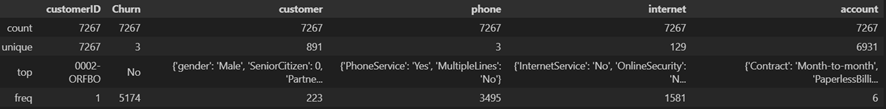

As colunas e seus subitens mais relevantes para análise são: 

['Churn', 'customer','phone','internet','account']


## Tratamento: Limpeza e transformação de dados
Verificando Inconsistências nos Dados:

```
dados.Churn.unique()
```
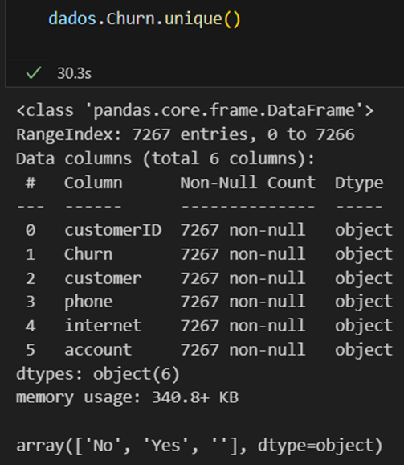

Observamos a ocorrência de campo vazio ‘’ em Churn.
Realizando a seleção “dados.query('"" in Churn')” foi observado 224 ocorrências de campo vazio em Churn.
Esses dados serão excluídos das análises por não serem válidos. Porém antes serão salvos (dados_churn_vazio = dados.query('"" in Churn'), para uma possível verificação (suposta) seja feita visando entender por que esses 224 casos estão com esse campo vazio.
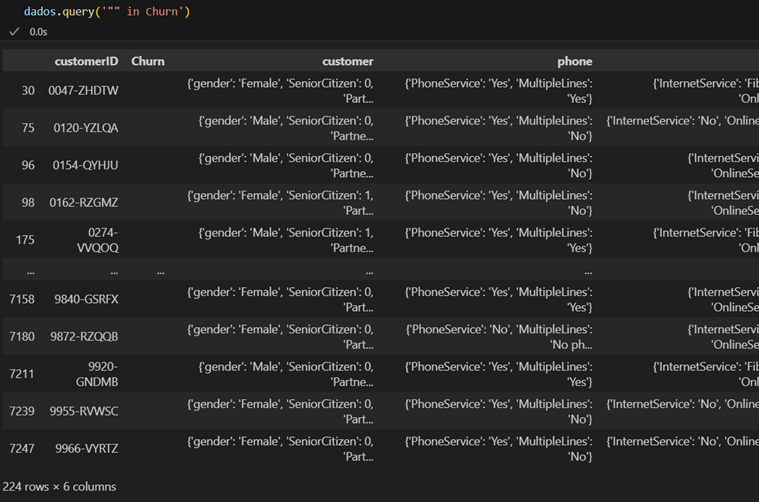

Dados possuí 7267 linhas.  Subtraindo 224 linhas, temos 7043.
Obtemos o dataframe atualizado com 7043 linhas:

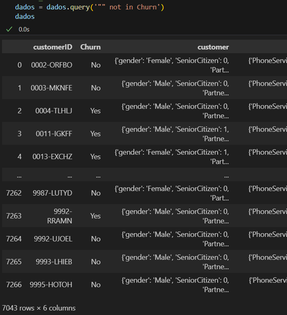

Testamos novamente e a gora sim obtemos apenas No ou Yes no campo Churn, o que é esperado: 
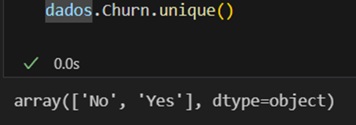

```
dados.isnull().sum()

```
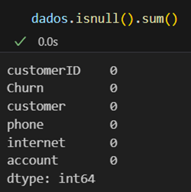

Verificando se o campo customerID possui valores duplicados:

```
len(pd.unique(dados["customerID"]))
```
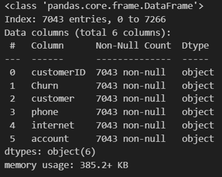


### Separando dados em colunas e criando coluna de "Contas Diárias"


```
dados["Monthly"] = dados["account"].apply(lambda x: x["Charges"]["Monthly"])
dados["Contas_Diarias"] = dados["Monthly"] / 30
```

Fazemos o mesmo com as outras colunas:

```
#explodindo cada coluna em um dataframe
df_customer = pd.json_normalize(dados['customer'])
df_phone = pd.json_normalize(dados['phone'])
df_internet = pd.json_normalize(dados['internet'])
df_account = pd.json_normalize(dados['account'])

# Concatenar tudo no DataFrame principal

dados = pd.concat([dados.drop(columns=["customer", "phone", "internet", "account"]), df_customer, df_phone, df_internet, df_account], axis=1)

dados.columns
```
Obtemos uma tabela com as seguintes colunas:

```
Index(['customerID', 'Churn', 'Monthly', 'Contas_Diarias', 'gender',
       'SeniorCitizen', 'Partner', 'Dependents', 'tenure', 'PhoneService',
       'MultipleLines', 'InternetService', 'OnlineSecurity', 'OnlineBackup',
       'DeviceProtection', 'TechSupport', 'StreamingTV', 'StreamingMovies',
       'Contract', 'PaperlessBilling', 'PaymentMethod', 'Charges.Monthly',
       'Charges.Total'],
      dtype='object')

```

Clientes evadidos:
São salvos no seguinte dataframe:
```
# clientes que saíram (Churn = "Yes")
dados_churn = dados[dados["Churn"] == "Yes"].copy()
```

Clientes não evadidos:
São salvos no seguinte dataframe:

```
# clientes que ficaram (Churn = "No")
dados_sem_churn = dados[dados["Churn"] == "No"].copy()
```

# Análise Exploratória de Dados

## Média, mediana, desvio padrão

### Total dos casos

```
dados.describe()
```
<div>
<style scoped>
    .dataframe tbody tr th:only-of-type {
        vertical-align: middle;
    }

    .dataframe tbody tr th {
        vertical-align: top;
    }

    .dataframe thead th {
        text-align: right;
    }
</style>
<table border="1" class="dataframe">
  <thead>
    <tr style="text-align: right;">
      <th></th>
      <th>Monthly</th>
      <th>Contas_Diarias</th>
      <th>SeniorCitizen</th>
      <th>tenure</th>
      <th>Charges.Monthly</th>
    </tr>
  </thead>
  <tbody>
    <tr>
      <th>count</th>
      <td>7043.000000</td>
      <td>7043.000000</td>
      <td>7043.000000</td>
      <td>7043.000000</td>
      <td>7043.000000</td>
    </tr>
    <tr>
      <th>mean</th>
      <td>64.761692</td>
      <td>2.158723</td>
      <td>0.162147</td>
      <td>32.371149</td>
      <td>64.761692</td>
    </tr>
    <tr>
      <th>std</th>
      <td>30.090047</td>
      <td>1.003002</td>
      <td>0.368612</td>
      <td>24.559481</td>
      <td>30.090047</td>
    </tr>
    <tr>
      <th>min</th>
      <td>18.250000</td>
      <td>0.608333</td>
      <td>0.000000</td>
      <td>0.000000</td>
      <td>18.250000</td>
    </tr>
    <tr>
      <th>25%</th>
      <td>35.500000</td>
      <td>1.183333</td>
      <td>0.000000</td>
      <td>9.000000</td>
      <td>35.500000</td>
    </tr>
    <tr>
      <th>50%</th>
      <td>70.350000</td>
      <td>2.345000</td>
      <td>0.000000</td>
      <td>29.000000</td>
      <td>70.350000</td>
    </tr>
    <tr>
      <th>75%</th>
      <td>89.850000</td>
      <td>2.995000</td>
      <td>0.000000</td>
      <td>55.000000</td>
      <td>89.850000</td>
    </tr>
    <tr>
      <th>max</th>
      <td>118.750000</td>
      <td>3.958333</td>
      <td>1.000000</td>
      <td>72.000000</td>
      <td>118.750000</td>
    </tr>
  </tbody>
</table>
</div>

Obtendo valores totais e percentuais:

```
print(dados["Churn"].value_counts())
print(dados["Churn"].value_counts(normalize=True) * 100)

```

```
Churn
No     5174
Yes    1869
Name: count, dtype: int64
Churn
No     73.463013
Yes    26.536987
Name: proportion, dtype: float64
```

Total com churn: 1869 \
Total sem churn: 5174

Obtemos um gráfico que melhor exibe essa porcentagem:

```
import matplotlib.pyplot as plt

dados["Churn"].value_counts().plot(kind="bar", color=["skyblue", "salmon"])
plt.title("Distribuição de Churn - Clientes")
plt.xlabel("Churn")
plt.ylabel("Número de Clientes")
plt.show()
```

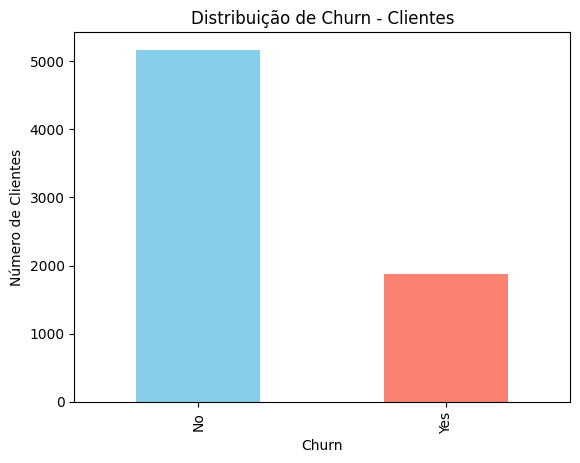


### Casos onde houve churn

```
# clientes que saíram (Churn = "Yes")
dados_churn = dados[dados["Churn"] == "Yes"].copy()
dados_churn.describe()
```

<div>
<style scoped>
    .dataframe tbody tr th:only-of-type {
        vertical-align: middle;
    }

    .dataframe tbody tr th {
        vertical-align: top;
    }

    .dataframe thead th {
        text-align: right;
    }
</style>
<table border="1" class="dataframe">
  <thead>
    <tr style="text-align: right;">
      <th></th>
      <th>Monthly</th>
      <th>Contas_Diarias</th>
      <th>SeniorCitizen</th>
      <th>tenure</th>
      <th>Charges.Monthly</th>
    </tr>
  </thead>
  <tbody>
    <tr>
      <th>count</th>
      <td>1869.000000</td>
      <td>1869.000000</td>
      <td>1821.000000</td>
      <td>1821.000000</td>
      <td>1821.000000</td>
    </tr>
    <tr>
      <th>mean</th>
      <td>74.441332</td>
      <td>2.481378</td>
      <td>0.155958</td>
      <td>31.833059</td>
      <td>64.821170</td>
    </tr>
    <tr>
      <th>std</th>
      <td>24.666053</td>
      <td>0.822202</td>
      <td>0.362915</td>
      <td>24.656511</td>
      <td>30.518745</td>
    </tr>
    <tr>
      <th>min</th>
      <td>18.850000</td>
      <td>0.628333</td>
      <td>0.000000</td>
      <td>0.000000</td>
      <td>18.700000</td>
    </tr>
    <tr>
      <th>25%</th>
      <td>56.150000</td>
      <td>1.871667</td>
      <td>0.000000</td>
      <td>8.000000</td>
      <td>33.750000</td>
    </tr>
    <tr>
      <th>50%</th>
      <td>79.650000</td>
      <td>2.655000</td>
      <td>0.000000</td>
      <td>27.000000</td>
      <td>70.450000</td>
    </tr>
    <tr>
      <th>75%</th>
      <td>94.200000</td>
      <td>3.140000</td>
      <td>0.000000</td>
      <td>55.000000</td>
      <td>90.600000</td>
    </tr>
    <tr>
      <th>max</th>
      <td>118.350000</td>
      <td>3.945000</td>
      <td>1.000000</td>
      <td>72.000000</td>
      <td>118.600000</td>
    </tr>
  </tbody>
</table>
</div>

```

```

### Casos onde não houve churn

```
# clientes que ficaram (Churn = "No")
dados_sem_churn = dados[dados["Churn"] == "No"].copy()
dados_sem_churn.describe()
```

<div>
<style scoped>
    .dataframe tbody tr th:only-of-type {
        vertical-align: middle;
    }

    .dataframe tbody tr th {
        vertical-align: top;
    }

    .dataframe thead th {
        text-align: right;
    }
</style>
<table border="1" class="dataframe">
  <thead>
    <tr style="text-align: right;">
      <th></th>
      <th>Monthly</th>
      <th>Contas_Diarias</th>
      <th>SeniorCitizen</th>
      <th>tenure</th>
      <th>Charges.Monthly</th>
    </tr>
  </thead>
  <tbody>
    <tr>
      <th>count</th>
      <td>5174.000000</td>
      <td>5174.000000</td>
      <td>5009.000000</td>
      <td>5009.000000</td>
      <td>5009.000000</td>
    </tr>
    <tr>
      <th>mean</th>
      <td>61.265124</td>
      <td>2.042171</td>
      <td>0.164105</td>
      <td>32.687163</td>
      <td>64.837832</td>
    </tr>
    <tr>
      <th>std</th>
      <td>31.092648</td>
      <td>1.036422</td>
      <td>0.370407</td>
      <td>24.517650</td>
      <td>29.962423</td>
    </tr>
    <tr>
      <th>min</th>
      <td>18.250000</td>
      <td>0.608333</td>
      <td>0.000000</td>
      <td>0.000000</td>
      <td>18.250000</td>
    </tr>
    <tr>
      <th>25%</th>
      <td>25.100000</td>
      <td>0.836667</td>
      <td>0.000000</td>
      <td>9.000000</td>
      <td>35.800000</td>
    </tr>
    <tr>
      <th>50%</th>
      <td>64.425000</td>
      <td>2.147500</td>
      <td>0.000000</td>
      <td>29.000000</td>
      <td>70.350000</td>
    </tr>
    <tr>
      <th>75%</th>
      <td>88.400000</td>
      <td>2.946667</td>
      <td>0.000000</td>
      <td>56.000000</td>
      <td>89.650000</td>
    </tr>
    <tr>
      <th>max</th>
      <td>118.750000</td>
      <td>3.958333</td>
      <td>1.000000</td>
      <td>72.000000</td>
      <td>118.750000</td>
    </tr>
  </tbody>
</table>
</div>


## Contagem de Evasão por Variáveis Categóricas

### Por gênero

```
taxa_churn_genero = pd.crosstab(dados["gender"], dados2["Churn"], normalize="index") * 100
taxa_churn_genero


taxa_churn_genero.plot(
    kind="bar", stacked=True, color=["skyblue", "salmon"], figsize=(8,5)
)
plt.title("Taxa de Churn por Genero")
plt.ylabel("Percentual (%)")
plt.xlabel("Genero")
plt.legend(title="Churn")
plt.show()


```
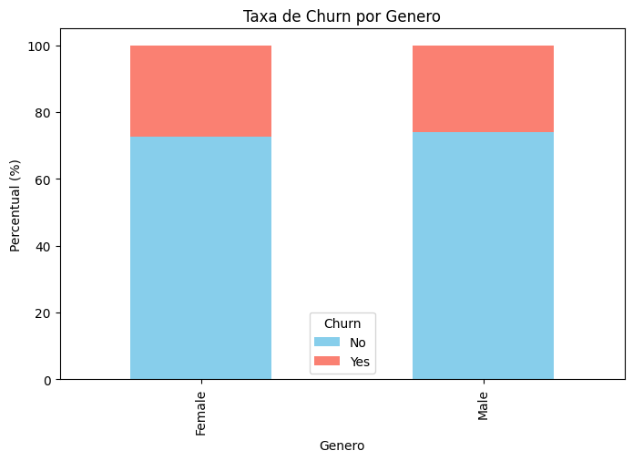

```
fig, axes = plt.subplots(1, len(taxa_churn_genero), figsize=(10,5))

for i, genero in enumerate(taxa_churn_genero.index):
    taxa_churn_genero.loc[genero].plot(
        kind="pie",
        autopct="%.1f%%",
        startangle=90,
        colors=["skyblue", "salmon"],
        ax=axes[i]
    )
    axes[i].set_ylabel("")
    axes[i].set_title(f"{genero}")

plt.suptitle("Taxa de Churn por Gênero")
plt.show()

```
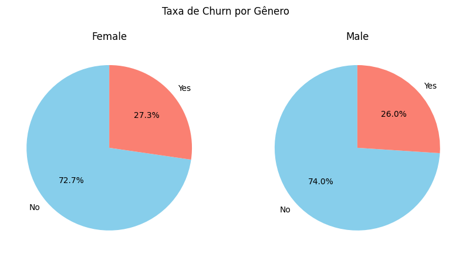

<div>
<style scoped>
    .dataframe tbody tr th:only-of-type {
        vertical-align: middle;
    }

    .dataframe tbody tr th {
        vertical-align: top;
    }

    .dataframe thead th {
        text-align: right;
    }
</style>
<table border="1" class="dataframe">
  <thead>
    <tr style="text-align: right;">
      <th>Churn</th>
      <th>No</th>
      <th>Yes</th>
    </tr>
    <tr>
      <th>gender</th>
      <th></th>
      <th></th>
    </tr>
  </thead>
  <tbody>
    <tr>
      <th>Female</th>
      <td>72.708518</td>
      <td>27.291482</td>
    </tr>
    <tr>
      <th>Male</th>
      <td>73.959849</td>
      <td>26.040151</td>
    </tr>
  </tbody>
</table>
</div>


### Por idade (Idoso)

```
taxa_churn_idoso = pd.crosstab(dados["SeniorCitizen"], dados["Churn"], normalize="index") * 100
taxa_churn_idoso


taxa_churn_idoso.plot(
    kind="bar", stacked=True, color=["skyblue", "salmon"], figsize=(8,5)
)
plt.title("Taxa de Churn Idoso")
plt.ylabel("Percentual (%)")
plt.xlabel("Idoso")
plt.legend(title="Churn")
plt.show()

taxa_churn_idoso
```
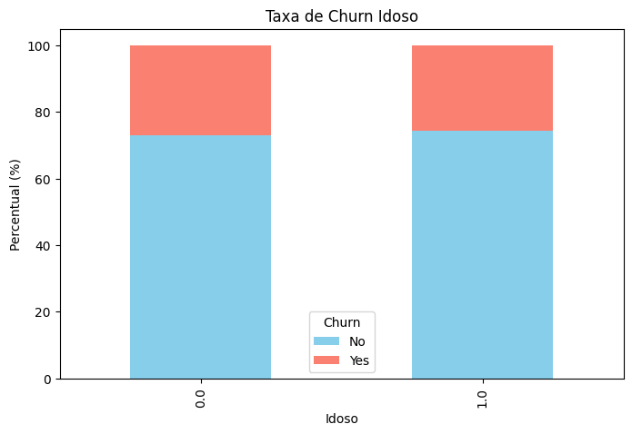

<div>
<style scoped>
    .dataframe tbody tr th:only-of-type {
        vertical-align: middle;
    }

    .dataframe tbody tr th {
        vertical-align: top;
    }

    .dataframe thead th {
        text-align: right;
    }
</style>
<table border="1" class="dataframe">
  <thead>
    <tr style="text-align: right;">
      <th>Churn</th>
      <th>No</th>
      <th>Yes</th>
    </tr>
    <tr>
      <th>SeniorCitizen</th>
      <th></th>
      <th></th>
    </tr>
  </thead>
  <tbody>
    <tr>
      <th>0.0</th>
      <td>73.148148</td>
      <td>26.851852</td>
    </tr>
    <tr>
      <th>1.0</th>
      <td>74.321881</td>
      <td>25.678119</td>
    </tr>
  </tbody>
</table>
</div>

### Por contrato

```
taxa_churn_contrato = pd.crosstab(dados["Contract"], dados["Churn"], normalize="index") * 100
taxa_churn_contrato

taxa_churn_contrato.plot(
    kind="pie", stacked=True, color=["skyblue", "salmon"], figsize=(8,5), subplots=True, autopct="%.1f%%", startangle=90, legend=False
)
plt.suptitle("Taxa de Churn por Tipo de Contrato", y = 0.8)
#plt.ylabel("Percentual (%)")
#plt.xlabel("Contrato")
plt.legend(title="Contrato", bbox_to_anchor = (1.05, 1), loc = "center")


plt.tight_layout()

plt.show()

```
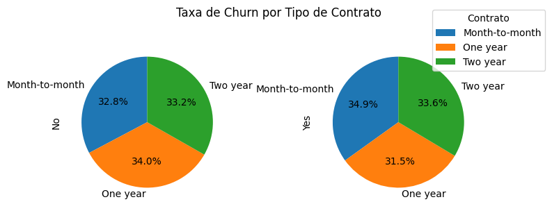

<div>
<style scoped>
    .dataframe tbody tr th:only-of-type {
        vertical-align: middle;
    }

    .dataframe tbody tr th {
        vertical-align: top;
    }

    .dataframe thead th {
        text-align: right;
    }
</style>
<table border="1" class="dataframe">
  <thead>
    <tr style="text-align: right;">
      <th>Churn</th>
      <th>No</th>
      <th>Yes</th>
    </tr>
    <tr>
      <th>Contract</th>
      <th></th>
      <th></th>
    </tr>
  </thead>
  <tbody>
    <tr>
      <th>Month-to-month</th>
      <td>72.513996</td>
      <td>27.486004</td>
    </tr>
    <tr>
      <th>One year</th>
      <td>75.227432</td>
      <td>24.772568</td>
    </tr>
    <tr>
      <th>Two year</th>
      <td>73.575758</td>
      <td>26.424242</td>
    </tr>
  </tbody>
</table>
</div>


### Por parceiro

```
taxa_churn_parceiro = pd.crosstab(dados["Partner"], dados["Churn"], normalize="index") * 100

taxa_churn_parceiro.plot(
    kind="bar", stacked=True, color=["skyblue", "salmon"], figsize=(8,5)
)
plt.title("Taxa de Churn - Parceiro")
plt.ylabel("Percentual (%)")
plt.xlabel("Parceiro")
plt.legend(title="Churn")
plt.show()

```


<div>
<style scoped>
    .dataframe tbody tr th:only-of-type {
        vertical-align: middle;
    }

    .dataframe tbody tr th {
        vertical-align: top;
    }

    .dataframe thead th {
        text-align: right;
    }
</style>
<table border="1" class="dataframe">
  <thead>
    <tr style="text-align: right;">
      <th>Churn</th>
      <th>No</th>
      <th>Yes</th>
    </tr>
    <tr>
      <th>Partner</th>
      <th></th>
      <th></th>
    </tr>
  </thead>
  <tbody>
    <tr>
      <th>No</th>
      <td>73.333333</td>
      <td>26.666667</td>
    </tr>
    <tr>
      <th>Yes</th>
      <td>73.343419</td>
      <td>26.656581</td>
    </tr>
  </tbody>
</table>
</div>

### Por dependentes

```
taxa_churn_dependentes = pd.crosstab(dados["Dependents"], dados["Churn"], normalize="index") * 100

taxa_churn_dependentes.plot(
    kind="bar", stacked=True, color=["skyblue", "salmon"], figsize=(8,5)
)
plt.title("Taxa de Churn - dependentes")
plt.ylabel("Percentual (%)")
plt.xlabel("dependentes")
plt.legend(title="Churn")
plt.show()
```
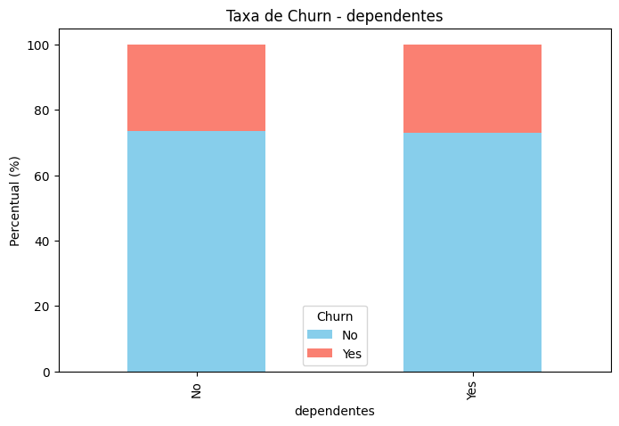

<div>
<style scoped>
    .dataframe tbody tr th:only-of-type {
        vertical-align: middle;
    }

    .dataframe tbody tr th {
        vertical-align: top;
    }

    .dataframe thead th {
        text-align: right;
    }
</style>
<table border="1" class="dataframe">
  <thead>
    <tr style="text-align: right;">
      <th>Churn</th>
      <th>No</th>
      <th>Yes</th>
    </tr>
    <tr>
      <th>Dependents</th>
      <th></th>
      <th></th>
    </tr>
  </thead>
  <tbody>
    <tr>
      <th>No</th>
      <td>73.544198</td>
      <td>26.455802</td>
    </tr>
    <tr>
      <th>Yes</th>
      <td>72.859922</td>
      <td>27.140078</td>
    </tr>
  </tbody>
</table>
</div>

### Por meses de contrato

```
taxa_churn_tenure = pd.crosstab(dados["tenure"], dados["Churn"], normalize="index") * 100

plt.figure(figsize=(10,5))

plt.plot(
    taxa_churn_tenure.index, 
    taxa_churn_tenure["Yes"], 
    marker="o", color="salmon", label="Churn"
)

plt.plot(
    taxa_churn_tenure.index, 
    taxa_churn_tenure["No"], 
    marker="o", color="skyblue", label="Não Churn"
)

plt.title("Taxa de Churn ao Longo do Tempo de Contrato")
plt.ylabel("Percentual (%)")
plt.xlabel("Meses de contrato")
plt.legend(title="Status")
plt.show()

```
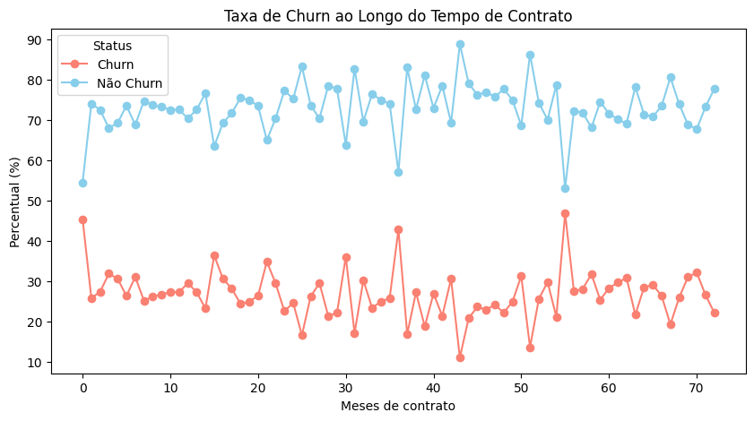

### Serviço de telefone

```
taxa_churn_PhoneService = pd.crosstab(dados["PhoneService"], dados["Churn"], normalize="index") * 100

taxa_churn_PhoneService.plot(
    kind="bar", stacked=True, color=["skyblue", "salmon"], figsize=(8,5)
)
plt.title("Taxa de Churn - PhoneService")
plt.ylabel("Percentual (%)")
plt.xlabel("PhoneService")
plt.legend(title="Churn")
plt.show()
```


<div>
<style scoped>
    .dataframe tbody tr th:only-of-type {
        vertical-align: middle;
    }

    .dataframe tbody tr th {
        vertical-align: top;
    }

    .dataframe thead th {
        text-align: right;
    }
</style>
<table border="1" class="dataframe">
  <thead>
    <tr style="text-align: right;">
      <th>Churn</th>
      <th>No</th>
      <th>Yes</th>
    </tr>
    <tr>
      <th>PhoneService</th>
      <th></th>
      <th></th>
    </tr>
  </thead>
  <tbody>
    <tr>
      <th>No</th>
      <td>74.961598</td>
      <td>25.038402</td>
    </tr>
    <tr>
      <th>Yes</th>
      <td>73.167179</td>
      <td>26.832821</td>
    </tr>
  </tbody>
</table>
</div>

### Multiplas linhas

```
taxa_churn_MultipleLines = pd.crosstab(dados["MultipleLines"], dados["Churn"], normalize="index") * 100

taxa_churn_MultipleLines.plot(
    kind="bar", stacked=True, color=["skyblue", "salmon"], figsize=(8,5)
)
plt.title("Taxa de Churn - MultipleLines")
plt.ylabel("Percentual (%)")
plt.xlabel("MultipleLines")
plt.legend(title="Churn")
plt.show()
```
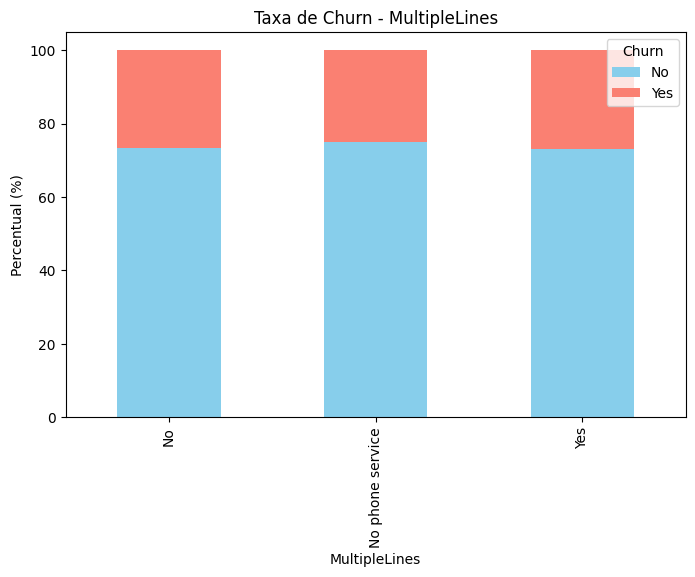

<div>
<style scoped>
    .dataframe tbody tr th:only-of-type {
        vertical-align: middle;
    }

    .dataframe tbody tr th {
        vertical-align: top;
    }

    .dataframe thead th {
        text-align: right;
    }
</style>
<table border="1" class="dataframe">
  <thead>
    <tr style="text-align: right;">
      <th>Churn</th>
      <th>No</th>
      <th>Yes</th>
    </tr>
    <tr>
      <th>MultipleLines</th>
      <th></th>
      <th></th>
    </tr>
  </thead>
  <tbody>
    <tr>
      <th>No</th>
      <td>73.329283</td>
      <td>26.670717</td>
    </tr>
    <tr>
      <th>No phone service</th>
      <td>74.961598</td>
      <td>25.038402</td>
    </tr>
    <tr>
      <th>Yes</th>
      <td>72.982335</td>
      <td>27.017665</td>
    </tr>
  </tbody>
</table>
</div>

### Serviço de internet

```
taxa_churn_InternetService = pd.crosstab(dados["InternetService"], dados["Churn"], normalize="index") * 100

taxa_churn_InternetService.plot(
    kind="bar", stacked=True, color=["skyblue", "salmon"], figsize=(8,5)
)
plt.title("Taxa de Churn - InternetService")
plt.ylabel("Percentual (%)")
plt.xlabel("InternetService")
plt.legend(title="Churn")
plt.show()
```
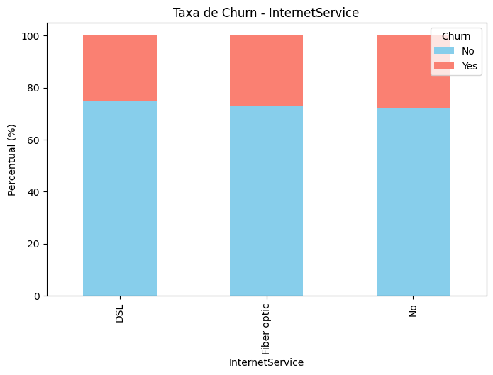

### Segurança online

```
taxa_churn_OnlineSecurity = pd.crosstab(dados["OnlineSecurity"], dados["Churn"], normalize="index") * 100

taxa_churn_OnlineSecurity.plot(
    kind="bar", stacked=True, color=["skyblue", "salmon"], figsize=(8,5)
)
plt.title("Taxa de Churn - OnlineSecurity")
plt.ylabel("Percentual (%)")
plt.xlabel("OnlineSecurity")
plt.legend(title="Churn")
plt.show()
```
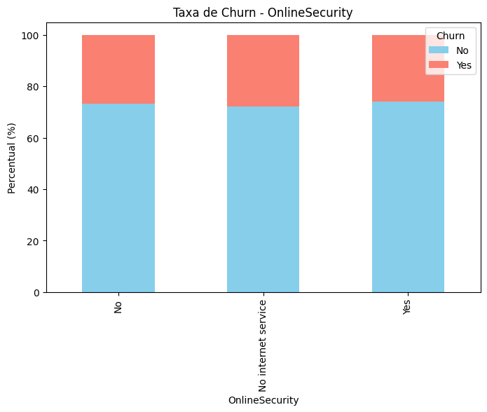

<div>
<style scoped>
    .dataframe tbody tr th:only-of-type {
        vertical-align: middle;
    }

    .dataframe tbody tr th {
        vertical-align: top;
    }

    .dataframe thead th {
        text-align: right;
    }
</style>
<table border="1" class="dataframe">
  <thead>
    <tr style="text-align: right;">
      <th>Churn</th>
      <th>No</th>
      <th>Yes</th>
    </tr>
    <tr>
      <th>OnlineSecurity</th>
      <th></th>
      <th></th>
    </tr>
  </thead>
  <tbody>
    <tr>
      <th>No</th>
      <td>73.343152</td>
      <td>26.656848</td>
    </tr>
    <tr>
      <th>No internet service</th>
      <td>72.180959</td>
      <td>27.819041</td>
    </tr>
    <tr>
      <th>Yes</th>
      <td>74.206755</td>
      <td>25.793245</td>
    </tr>
  </tbody>
</table>
</div>


### Backup online

```
taxa_churn_OnlineBackup = pd.crosstab(dados["OnlineBackup"], dados["Churn"], normalize="index") * 100

taxa_churn_OnlineBackup.plot(
    kind="bar", stacked=True, color=["skyblue", "salmon"], figsize=(8,5)
)
plt.title("Taxa de Churn - OnlineBackup")
plt.ylabel("Percentual (%)")
plt.xlabel("OnlineBackup")
plt.legend(title="Churn")
plt.show()
```


### Proteção de dispositivo

```
taxa_churn_DeviceProtection = pd.crosstab(dados["DeviceProtection"], dados["Churn"], normalize="index") * 100

taxa_churn_OnlineBackup.plot(
    kind="bar", stacked=True, color=["skyblue", "salmon"], figsize=(8,5)
)
plt.title("Taxa de Churn - DeviceProtection")
plt.ylabel("Percentual (%)")
plt.xlabel("DeviceProtection")
plt.legend(title="Churn")
plt.show()
```


<div>
<style scoped>
    .dataframe tbody tr th:only-of-type {
        vertical-align: middle;
    }

    .dataframe tbody tr th {
        vertical-align: top;
    }

    .dataframe thead th {
        text-align: right;
    }
</style>
<table border="1" class="dataframe">
  <thead>
    <tr style="text-align: right;">
      <th>Churn</th>
      <th>No</th>
      <th>Yes</th>
    </tr>
    <tr>
      <th>DeviceProtection</th>
      <th></th>
      <th></th>
    </tr>
  </thead>
  <tbody>
    <tr>
      <th>No</th>
      <td>74.032043</td>
      <td>25.967957</td>
    </tr>
    <tr>
      <th>No internet service</th>
      <td>72.180959</td>
      <td>27.819041</td>
    </tr>
    <tr>
      <th>Yes</th>
      <td>73.183170</td>
      <td>26.816830</td>
    </tr>
  </tbody>
</table>
</div>


### Suporte técnico

```
taxa_churn_TechSupport = pd.crosstab(dados["TechSupport"], dados["Churn"], normalize="index") * 100

taxa_churn_TechSupport.plot(
    kind="bar", stacked=True, color=["skyblue", "salmon"], figsize=(8,5)
)
plt.title("Taxa de Churn - TechSupport")
plt.ylabel("Percentual (%)")
plt.xlabel("TechSupport")
plt.legend(title="Churn")
plt.show()
```
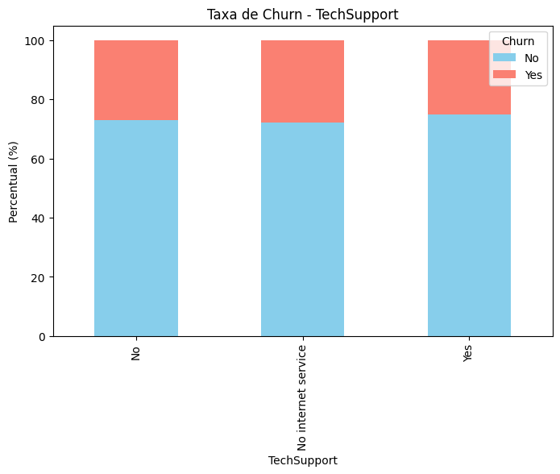
<div>
<style scoped>
    .dataframe tbody tr th:only-of-type {
        vertical-align: middle;
    }

    .dataframe tbody tr th {
        vertical-align: top;
    }

    .dataframe thead th {
        text-align: right;
    }
</style>
<table border="1" class="dataframe">
  <thead>
    <tr style="text-align: right;">
      <th>Churn</th>
      <th>No</th>
      <th>Yes</th>
    </tr>
    <tr>
      <th>TechSupport</th>
      <th></th>
      <th></th>
    </tr>
  </thead>
  <tbody>
    <tr>
      <th>No</th>
      <td>72.959335</td>
      <td>27.040665</td>
    </tr>
    <tr>
      <th>No internet service</th>
      <td>72.180959</td>
      <td>27.819041</td>
    </tr>
    <tr>
      <th>Yes</th>
      <td>74.848485</td>
      <td>25.151515</td>
    </tr>
  </tbody>
</table>
</div>


### TV por streaming

```
taxa_churn_StreamingTV = pd.crosstab(dados["StreamingTV"], dados["Churn"], normalize="index") * 100

taxa_churn_StreamingTV.plot(
    kind="bar", stacked=True, color=["skyblue", "salmon"], figsize=(8,5)
)
plt.title("Taxa de Churn - StreamingTV")
plt.ylabel("Percentual (%)")
plt.xlabel("StreamingTV")
plt.legend(title="Churn")
plt.show()
```
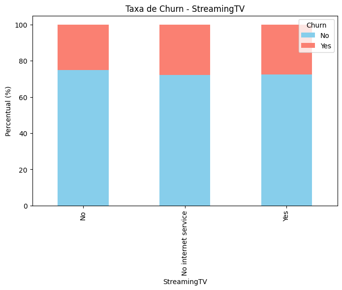

<div>
<style scoped>
    .dataframe tbody tr th:only-of-type {
        vertical-align: middle;
    }

    .dataframe tbody tr th {
        vertical-align: top;
    }

    .dataframe thead th {
        text-align: right;
    }
</style>
<table border="1" class="dataframe">
  <thead>
    <tr style="text-align: right;">
      <th>Churn</th>
      <th>No</th>
      <th>Yes</th>
    </tr>
    <tr>
      <th>StreamingTV</th>
      <th></th>
      <th></th>
    </tr>
  </thead>
  <tbody>
    <tr>
      <th>No</th>
      <td>74.871229</td>
      <td>25.128771</td>
    </tr>
    <tr>
      <th>No internet service</th>
      <td>72.180959</td>
      <td>27.819041</td>
    </tr>
    <tr>
      <th>Yes</th>
      <td>72.405929</td>
      <td>27.594071</td>
    </tr>
  </tbody>
</table>
</div>

### Filmes por streaming

```
taxa_churn_StreamingMovies = pd.crosstab(dados["StreamingMovies"], dados["Churn"], normalize="index") * 100

taxa_churn_StreamingMovies.plot(
    kind="bar", stacked=True, color=["skyblue", "salmon"], figsize=(8,5)
)
plt.title("Taxa de Churn - StreamingMovies")
plt.ylabel("Percentual (%)")
plt.xlabel("StreamingMovies")
plt.legend(title="Churn")
plt.show()
```


<div>
<style scoped>
    .dataframe tbody tr th:only-of-type {
        vertical-align: middle;
    }

    .dataframe tbody tr th {
        vertical-align: top;
    }

    .dataframe thead th {
        text-align: right;
    }
</style>
<table border="1" class="dataframe">
  <thead>
    <tr style="text-align: right;">
      <th>Churn</th>
      <th>No</th>
      <th>Yes</th>
    </tr>
    <tr>
      <th>StreamingMovies</th>
      <th></th>
      <th></th>
    </tr>
  </thead>
  <tbody>
    <tr>
      <th>No</th>
      <td>73.489062</td>
      <td>26.510938</td>
    </tr>
    <tr>
      <th>No internet service</th>
      <td>72.180959</td>
      <td>27.819041</td>
    </tr>
    <tr>
      <th>Yes</th>
      <td>73.831071</td>
      <td>26.168929</td>
    </tr>
  </tbody>
</table>
</div>


### Fatura digital

```
taxa_churn_PaperlessBilling = pd.crosstab(dados["PaperlessBilling"], dados["Churn"], normalize="index") * 100

taxa_churn_PaperlessBilling.plot(
    kind="bar", stacked=True, color=["skyblue", "salmon"], figsize=(8,5)
)
plt.title("Taxa de Churn - PaperlessBilling")
plt.ylabel("Percentual (%)")
plt.xlabel("PaperlessBilling")
plt.legend(title="Churn")
plt.show()
```
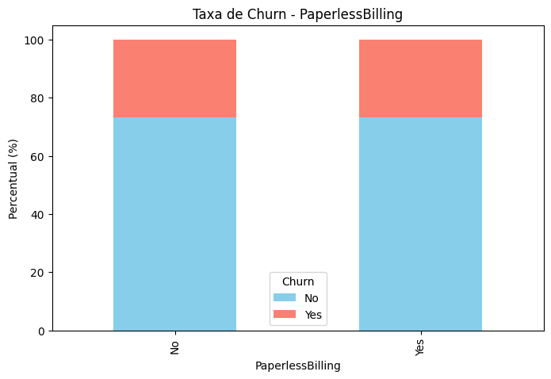

<div>
<style scoped>
    .dataframe tbody tr th:only-of-type {
        vertical-align: middle;
    }

    .dataframe tbody tr th {
        vertical-align: top;
    }

    .dataframe thead th {
        text-align: right;
    }
</style>
<table border="1" class="dataframe">
  <thead>
    <tr style="text-align: right;">
      <th>Churn</th>
      <th>No</th>
      <th>Yes</th>
    </tr>
    <tr>
      <th>PaperlessBilling</th>
      <th></th>
      <th></th>
    </tr>
  </thead>
  <tbody>
    <tr>
      <th>No</th>
      <td>73.335732</td>
      <td>26.664268</td>
    </tr>
    <tr>
      <th>Yes</th>
      <td>73.339916</td>
      <td>26.660084</td>
    </tr>
  </tbody>
</table>
</div>


### Método de pagamento

```
taxa_churn_PaymentMethod = pd.crosstab(dados["PaymentMethod"], dados["Churn"], normalize="index") * 100

taxa_churn_PaymentMethod.plot(
    kind="bar", stacked=True, color=["skyblue", "salmon"], figsize=(8,5)
)
plt.title("Taxa de Churn - PaymentMethod")
plt.ylabel("Percentual (%)")
plt.xlabel("PaymentMethod")
plt.legend(title="Churn")
plt.show()
```
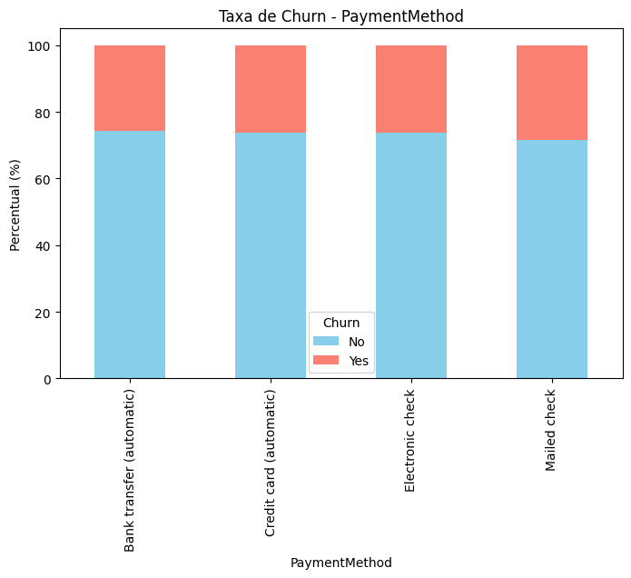

<div>
<style scoped>
    .dataframe tbody tr th:only-of-type {
        vertical-align: middle;
    }

    .dataframe tbody tr th {
        vertical-align: top;
    }

    .dataframe thead th {
        text-align: right;
    }
</style>
<table border="1" class="dataframe">
  <thead>
    <tr style="text-align: right;">
      <th>Churn</th>
      <th>No</th>
      <th>Yes</th>
    </tr>
    <tr>
      <th>PaymentMethod</th>
      <th></th>
      <th></th>
    </tr>
  </thead>
  <tbody>
    <tr>
      <th>Bank transfer (automatic)</th>
      <td>74.184963</td>
      <td>25.815037</td>
    </tr>
    <tr>
      <th>Credit card (automatic)</th>
      <td>73.648186</td>
      <td>26.351814</td>
    </tr>
    <tr>
      <th>Electronic check</th>
      <td>73.848827</td>
      <td>26.151173</td>
    </tr>
    <tr>
      <th>Mailed check</th>
      <td>71.483376</td>
      <td>28.516624</td>
    </tr>
  </tbody>
</table>
</div>


```

```

# Conclussões

**Taxa de churn geral**: 26,5% dos clientes cancelaram os serviços (1.869 de 7.043 clientes).

Clientes com **churn** têm **gasto médio mensal maior** (R$ 74,44) em comparação aos que permanecem (R$ 61,26).

    Pode indicar sensibilidade ao preço ou percepção de custo-benefício insatisfatória.

O **churn é maior nos primeiros meses** e tende a cair com a fidelização.

    Indica que a fase inicial é crítica para retenção.

Contratos:
* Month-to-month apresenta churn mais alto (27,5%).

* Contratos anuais e bienais têm churn menor (~25%).

Serviços adicionais:

* Clientes sem serviços de segurança online, backup ou suporte técnico apresentam churn maior.

* Adesão a pacotes adicionais reduz a evasão.

Método de pagamento:

* Clientes com fatura enviada por correio (mailed check) têm maior churn (28,5%).

* Métodos automáticos (débito e cartão) estão associados a menor evasão (~25%).

Perfil etário e demográfico:

    Não houve diferenças expressivas de churn entre gêneros ou idosos x não idosos.

    Presença de parceiros e dependentes também não apresentou impacto significativo.
